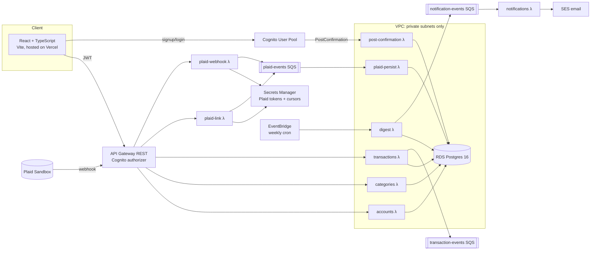

# FinanceApp

A multi-user personal finance tracker: accounts, categories, and transactions, entered manually or synced from a bank through Plaid (sandbox). A weekly spending digest is emailed to each user.

I built it to learn AWS system design hands-on: serverless compute, API Gateway with Cognito auth, private networking, event-driven pipelines with SQS, and managing all of it with Terraform.

## Architecture



### Request flow
1. A user signs up through **Cognito**. The `PostConfirmation` trigger Lambda creates their row in `users`.
2. The frontend sends the Cognito ID token on every call. **API Gateway's Cognito authorizer** rejects any request without a valid token before a Lambda ever runs.
3. Each resource (`/accounts`, `/categories`, `/transactions`) is handled by one Lambda running a small **Hono** router. Every query is scoped to the caller's `user_id`, which is looked up from the token's `sub` claim, so users can't read or change each other's data.

### Plaid sync (async)
1. `plaid-link` creates a Link token and exchanges the public token for an access token. It stores the token in **Secrets Manager** and puts an `item_created` event on SQS.
2. When Plaid calls the webhook with `SYNC_UPDATES_AVAILABLE`, `plaid-webhook` pages through `/transactions/sync` from the stored cursor, saves the new cursor, and puts the changes on SQS.
3. `plaid-persist` runs inside the VPC and consumes that queue. It upserts rows into Postgres, keyed on Plaid's transaction ID, so redelivered messages are idempotent. Re-syncs don't overwrite a category the user set by hand.

### Weekly digest
An **EventBridge** cron triggers `digest`. It totals each user's last 7 days of transactions by category and puts one message per user on SQS. `notifications` sends each message as an email through **SES**.

Every queue has a **dead-letter queue** (`maxReceiveCount = 4`) and a **CloudWatch alarm** on DLQ depth.

## Tech stack

| Layer | Tech |
|---|---|
| Frontend | React 19, TypeScript, Vite, React Router, `react-plaid-link` (hosted on Vercel) |
| API | AWS API Gateway (REST), Cognito authorizer |
| Compute | AWS Lambda (Node.js 22), Hono, Zod validation, bundled with esbuild |
| Data | RDS PostgreSQL 16, Drizzle ORM and migrations |
| Async | SQS + DLQs, EventBridge scheduler, SES |
| Secrets | Secrets Manager (RDS master password managed by RDS; Plaid credentials and per-item tokens) |
| Infra | Terraform (modular: `network`, `database`, `auth`, `api`, `async`, `plaid`, `migrate`) |
| Testing | Vitest: unit tests per handler, plus integration tests against the deployed API |

## Design decisions and tradeoffs

- **No NAT Gateway.** The VPC has only private subnets: no internet gateway, no NAT. Lambdas that need RDS and also SQS reach SQS through a **VPC interface endpoint** (about $7/month, versus about $32/month for NAT). Lambdas that need the public internet (Plaid) run outside the VPC, which is why Plaid access tokens live in Secrets Manager rather than Postgres.
- **Locked-down database.** RDS isn't publicly accessible. Its security group only allows port 5432 from the Lambda security group, and RDS creates and rotates the master password itself.
- **Lambda instead of EC2/containers.** Traffic is low and spiky, so pay-per-invocation and no servers to manage fit well. The known cost is connection fanout to Postgres. Each container reuses one connection while it stays warm; **RDS Proxy** is the next step under real concurrency (it isn't in the free tier).
- **Queue between webhook and database.** The webhook returns to Plaid quickly and never touches the database. SQS absorbs retries, and the DLQ plus alarm make failures visible instead of silent.
- **At-least-once delivery handled with idempotent writes.** Unique constraints on `plaid_transaction_id` / `plaid_account_id` plus `ON CONFLICT` upserts make replaying a message safe.
- **Money stored as `numeric(12,2)`**, never floating point.

## Repo layout

```
backend/
  src/db/schema.ts          Drizzle schema (users, categories, accounts, transactions, plaid_items)
  src/lambdas/<name>/       one handler per Lambda (+ unit tests)
  src/integration/          integration tests against the deployed API
  drizzle/                  generated SQL migrations
  scripts/build-<name>.sh   esbuild bundle -> dist/<name>.zip
frontend/                   React SPA
infra/
  modules/                  Terraform modules
  envs/dev/                 dev environment (root module)
docs/superpowers/           design spec and phase-by-phase implementation plans
```

## Running it

**Prerequisites:** Node 22, Terraform ≥ 1.7, an AWS CLI profile, a Plaid sandbox account, and an SES-verified sender email.

```bash
# 1. Build the Lambda bundles
cd backend && npm install
for f in scripts/build-*.sh; do bash "$f"; done

# 2. Provision infrastructure
cd ../infra/envs/dev
# create terraform.tfvars with: aws_profile, ses_sender_email, plaid_client_id, plaid_secret, plaid_env
terraform init && terraform apply

# 3. Apply database migrations (invoke the migrate Lambda)
aws lambda invoke --function-name dev-financeapp-migrate /dev/stdout

# 4. Run the frontend
cd ../../../frontend && npm install
cp .env.example .env   # fill in values from `terraform output`
npm run dev
```

To link a bank in the Plaid modal, use `user_good` / `pass_good`. For an item where you can create test transactions via `/sandbox/transactions/create`, use `user_transactions_dynamic`.

### Tests

```bash
cd backend
npm test                     # unit tests (mocked)
API_BASE_URL=... TEST_USER_EMAIL=... TEST_USER_PASSWORD=... \
  npm run test:integration   # hits the real deployed stack
```

## Status and next steps

Done: infrastructure, auth, core CRUD API, frontend, the async digest/notification pipeline, and Plaid sandbox sync.

Next:
- Lambdas read DB credentials from Secrets Manager at runtime instead of receiving them as environment variables at deploy time
- Remote Terraform state (S3 + DynamoDB lock table)
- RDS Proxy for connection pooling
- Optimistic UI updates on the frontend (it currently refetches after every write)
- CloudWatch dashboards and X-Ray tracing
- CI/CD with GitHub Actions (terraform plan/apply, Lambda deploys)
